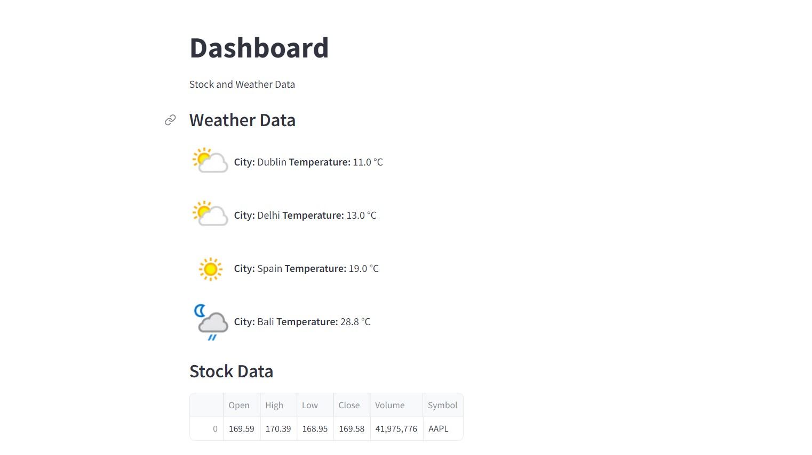
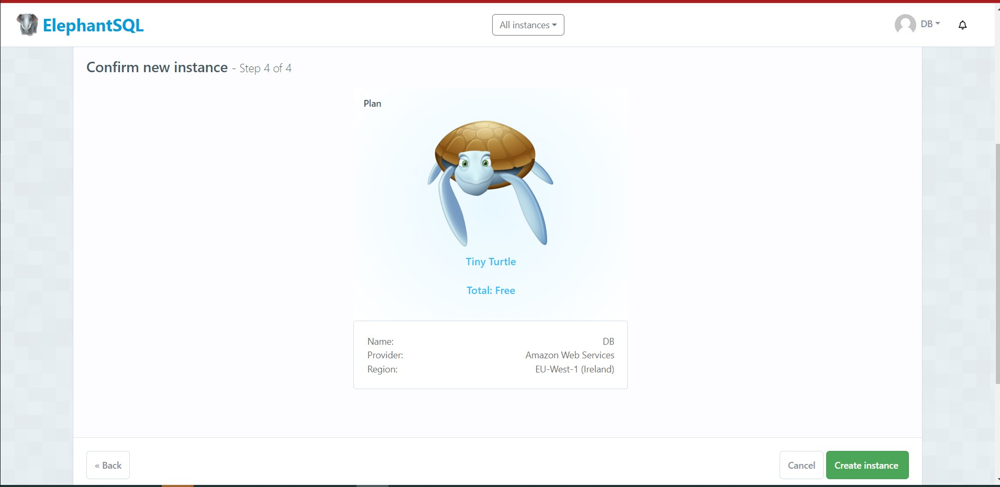

# Weather/Stock data to a Streamlit dashboard

# 1. Project Overview

This project focuses on gathering weather data for [`Dublin`, `Delhi`, `Spain`, `Bali`] using the Open Meteo API and utilizing Apache Airflow, ElephantSQL, and Streamlit to create a simple dashboard from the data.

By leveraging the Open Meteo API, the project retrieves up-to-date weather information for [`Dublin`, `Delhi`, `Spain`, `Bali`]. Apache Airflow is employed to automate the extraction and transformation of this data, ensuring a continuous and reliable pipeline.

The weather data is then stored and managed in DB on elephantSQL, a powerful cloud-based Postgres database. And lastly Streamlit is used to visualize the data.

The outcome was a simple dashboard containing the daily average temperature of these cities and stock valuation.

# 2. Retrieving the data from the API

The data source for this project is an API that provides weather forecasts. The API offers the following features:

* End point ***'[https://api.weatherapi.com/v1/](https://api.weatherapi.com/v1/)'***
* Parameters 
    * ***'location'***:  Name of the location (optional).
    * ***'latitude'*** & ***'longitude'***:  Geographical coordinates of the location (optional).
    * ***'elevation'***: Elevation used for statistical downscaling (optional).
    * ***'hourly'***: List of weather variables to be returned (optional).
    * ***'daily'***: List of daily weather variable aggregations to be returned (optional).
    * ***'current_weather'***: Flag to include current weather conditions in the output (optional).
    * Other parameters such as temperature unit, windspeed unit, time format, timezone, etc. (optional).

## 2.1 Integration
\
The integration with the API involves making HTTP requests to the ***'/v1'*** endpoint, passing the necessary parameters, and retrieving the JSON response containing the weather forecast data.

The API documentation [https://www.weatherapi.com/docs/](https://www.weatherapi.com/docs/) provides detailed information about the available parameters, valid values, and the structure of the JSON response. By leveraging the API's capabilities, we can retrieve accurate and up-to-date weather forecasts for a given location.

# 3. [ElephantSQL](https://www.elephantsql.com/) integration

The Integration to ElephantSQL begins from creating the necessary database for the project in [ElephantSQl portal](https://www.elephantsql.com/):

After creating the database save username and password

# 4. Streamlit

# Conclusion 

In conclusion, the main focus of the project was to learn how to integrate Apache Airflow with various service providers. This involved understanding the concepts of Apache Airflow, exploring different service providers' APIs, and implementing the necessary connections to enable seamless integration.

Future improvement ideas could include retrieving data for more than one city and modifying the dashboard in a way that the user could select the city for which they would want to display the weather information.

# Resources 

To learn more about these Resources you can Refer to some of these articles written by Me:-

[https://medium.com/@vaibhavji/airflow-end-to-end-project-etl-pipeline-using-airflow-for-weather-reports-on-streamlit-0e81811930d0](https://medium.com/@vaibhavji/airflow-end-to-end-project-etl-pipeline-using-airflow-for-weather-reports-on-streamlit-0e81811930d0)

- [Medium](https://medium.com/geeky-bawa)
- [geeky Traveller](https://sites.google.com/view/geeky-traveller/)
- [Blogs](https://github.com/vaibhavhariaramani/blogs)
- [Youtube](https://www.youtube.com/channel/UCy7amUpLnsRLEMIaJGGBYog)

### Don't forget to tag us

if you use this repo in  your project don't forget to mention us as Contributer in it . And Don't forget to tag us [Linkedin](https://www.linkedin.com/in/vaibhav-hariramani-087488186/),[ instagram](https://www.instagram.com/geeky_baba_/?hl=en),[ facebook](https://www.facebook.com/jayesh.hariramani.3) ,[ twitter](https://www.linkedin.com/in/vaibhav-hariramani-087488186/), [ Github](https://github.com/vaibhavhariaramani) 

============================================================================
# Made with ❤️by Vaibhav Hariramani
#### About me

I am a Machine Learning enthusiast, an Actions on Google Developer, Internet of things, Alexa Skills, and Image processing developer.
I have a keen interest in Image processing and Andriod development.
I am Currently studying at  Chandigarh University, Punjab.

[My PortFolio](https://vaibhavhariaramani.github.io/)
You can find me at:-
[Linkedin](https://www.linkedin.com/in/vaibhav-hariramani-087488186/) or [Github](https://github.com/vaibhavhariaramani) .

Email: [vaibhav.hariramani01@gmail.com](mailto:vaibhav.hariramani01@gmail.com)

# Download [THE VAIBHAV HARIRAMANI APP](https://github.com/vaibhavhariaramani/The-Vaibhav-Hariramani-App/raw/master/vaibhav%20hariramani%20app.apk)

#  

&nbsp;&nbsp;
&nbsp;&nbsp;
&nbsp;&nbsp;

&nbsp;&nbsp;
&nbsp;&nbsp;

[The Vaibhav Hariramani App (Latest Version) ](https://github.com/vaibhavhariaramani/The-Vaibhav-Hariramani-App/raw/master/vaibhav%20hariramani%20app.apk)

Download [THE VAIBHAV HARIRAMANI APP](https://github.com/vaibhavhariaramani/The-Vaibhav-Hariramani-App/raw/master/vaibhav%20hariramani%20app.apk) consist of Tutorials,Projects,Blogs and Vlogs of our Site developed Using Android Studio with Web View try installing it in your android device.

Happy coding ❤️ .

### Follow me
  
   [![GitHub Badge]